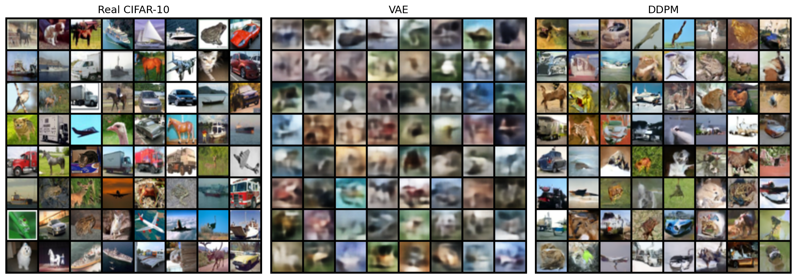
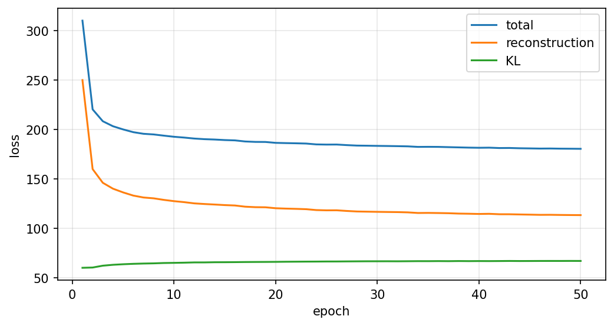
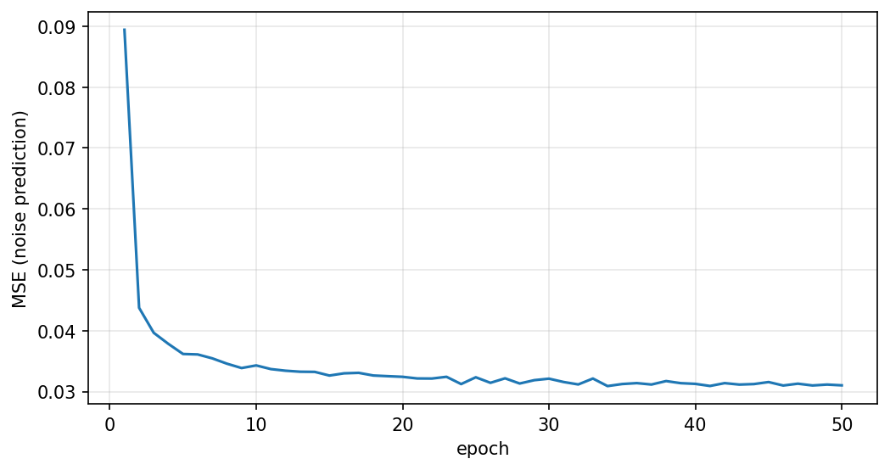

# VAE vs DDPM from Scratch (CIFAR-10)

Task GenCV003: implement a **Variational Autoencoder (VAE)** and a **Denoising Diffusion Probabilistic Model (DDPM)** from scratch in PyTorch, train both on CIFAR-10, and compare them quantitatively (FID, Inception Score, training and sampling cost) and qualitatively.

Everything (models, losses, noise schedule, samplers, training loops) is written by hand. The only external helper is `torch-fidelity`, used to compute FID and Inception Score.

The full write-up (implementation details, analysis, and the main differences between the two approaches) is in [`report/report.pdf`](report/report.pdf) (please download the report to see it).

## Results

Evaluated with **3000 generated images per model** against the 50,000 CIFAR-10 training images. Both models were trained for 50 epochs (19,500 gradient steps) on one NVIDIA T4 (Google Colab).

| Model | FID ↓ | Inception Score ↑ | Train time | Sampling speed | Parameters |
|---|---|---|---|---|---|
| Real test images (reference) | 3.15 | 10.96 ± 0.23 | – | – | – |
| VAE | 127.32 | 3.46 ± 0.10 | 14.3 min | ~14,000 img/s | 2.9 M |
| DDPM (EMA weights) | **32.22** | **6.77 ± 0.34** | 83.5 min | ~0.95 img/s | 9.0 M |

Raw numbers are in [`outputs/results.json`](outputs/results.json).

**Takeaway:** the DDPM gives much better samples (FID about 4x lower), while the VAE is roughly 15,000x faster at generating images because it needs a single decoder pass instead of 1000 denoising steps.

> FID is biased upwards for small sample sizes, so compare the two models with each other (same N), not with published numbers computed on 50,000 samples. See the report for all caveats.

### Samples

Left: real CIFAR-10 test images. Middle: VAE. Right: DDPM (first 64 generated images, fixed seed, not hand-picked).



Training curves:

| VAE | DDPM |
|---|---|
|  |  |

Samples after training: [`outputs/vae/samples/epoch_50.png`](outputs/vae/samples/epoch_50.png) and [`outputs/ddpm/samples/epoch_50.png`](outputs/ddpm/samples/epoch_50.png).

## Repository structure

```
.
├── configs/
│   ├── vae.yaml              # VAE hyper-parameters
│   └── ddpm.yaml             # DDPM hyper-parameters
├── src/
│   ├── datasets/dataset.py   # CIFAR-10 loading, scaling to [-1, 1]
│   ├── vae/                  # model.py, loss.py, train.py, sample.py
│   ├── ddpm/                 # model.py (U-Net), diffusion.py, train.py, sample.py
│   ├── evaluation/           # metrics.py (FID/IS), visualize.py (comparison figure)
│   └── utils/                # seed.py, checkpoint.py, ema.py
├── evaluate.py               # generates images, computes FID/IS and speed, writes results.json
├── notebooks/
│   ├── run_vae_on_colab.ipynb
│   ├── run_ddpm_on_colab.ipynb
│   └── run_evaluation_on_colab.ipynb
├── outputs/                  # samples, plots, results.json, comparison.png (checkpoints are not stored in git)
├── report/report.pdf
└── requirements.txt
```

## How to reproduce

### 1. Setup

```bash
git clone https://github.com/Besh00Y/vae-ddpm-from-scratch.git
cd vae-ddpm-from-scratch
python -m venv .venv && source .venv/bin/activate     # Windows: .venv\Scripts\activate
pip install -r requirements.txt
```

A CUDA GPU is strongly recommended. The VAE trains in minutes, but the DDPM needs a GPU (about 1.7 min per epoch on a T4). CIFAR-10 is downloaded automatically into `data/` on the first run.

### 2. Train

```bash
python -m src.vae.train  --config configs/vae.yaml
python -m src.ddpm.train --config configs/ddpm.yaml
```

Useful options: `--epochs N`, `--output_dir PATH`, `--no_resume`. Training **resumes automatically** from the latest checkpoint in the checkpoint folder, which is helpful on Colab where sessions can disconnect. To keep checkpoints elsewhere (for example Google Drive), set `ckpt_dir` in the YAML config or pass a different `--output_dir`.

Outputs are written to `outputs/vae/` and `outputs/ddpm/`:

- `checkpoints/epoch_*.pt` (not committed because of their size)
- `samples/epoch_*.png` (preview grids)
- `plots/history.json` (loss history and total training time)

### 3. Generate samples

```bash
python -m src.vae.sample  --n 64
python -m src.ddpm.sample --n 64     # uses the EMA weights; 1000 sampling steps
```

### 4. Evaluate (FID, Inception Score, speed)

```bash
python evaluate.py --models vae ddpm --n 3000 --baseline
```

This loads the latest checkpoint of each model (from `outputs/vae/checkpoints` and `outputs/ddpm/checkpoints`; override with `--vae_dir` and `--ddpm_dir`), generates `N` images per model into `outputs/generated/`, computes FID and Inception Score against the CIFAR-10 training set, measures sampling speed, and writes `outputs/results.json`. `--baseline` also scores the real test images as a reference. Generation resumes if interrupted.

The first run downloads the Inception weights used by `torch-fidelity` (about 170 MB).

Comparison figure:

```bash
python -m src.evaluation.visualize \
  --vae_gen outputs/generated/vae_3000 \
  --ddpm_gen outputs/generated/ddpm_3000 \
  --out outputs/comparison.png
```

Sampling 3000 images with the DDPM takes roughly one hour on a T4.

### Running on Google Colab

Note: The notebooks in notebooks/ are clean templates without saved cell outputs. I ran the DDPM notebook on Colab, but I forgot to save the executed copy, so its console log is not included. The training results are preserved in outputs/ddpm/plots/history.json (per-epoch loss and training time), outputs/ddpm/samples/, and outputs/results.json.

The three notebooks in `notebooks/` run the whole pipeline on a free T4: they clone this repo, store checkpoints on Google Drive, and can resume after a disconnect. Open a notebook, set your GitHub username in the clone cell, select a GPU runtime, and run the cells in order.

## Implementation summary

**VAE** (`src/vae`): convolutional encoder (3 strided convs, 4096 features) to a 128-d Gaussian latent, transposed-convolution decoder with a Tanh output. Loss = MSE summed over pixels + KL divergence (beta = 1), trained with the reparameterization trick. Adam, lr 1e-3, batch 128.

**DDPM** (`src/ddpm`): 1000-step linear noise schedule (1e-4 to 0.02), closed-form forward process, noise-prediction (epsilon) loss, and a U-Net with residual blocks, sinusoidal time embeddings, GroupNorm and self-attention at 16x16 and in the bottleneck. Adam, lr 2e-4, batch 128, gradient clipping, mixed precision, EMA (decay 0.999). Sampling is full ancestral sampling over 1000 steps.

## Limitations

- The DDPM was trained for only 50 epochs; longer training should improve it further.
- FID/IS use 3000 samples, a single run and one seed.
- The two models differ in size (2.9 M vs 9.0 M parameters) and received no hyper-parameter search.

Details and discussion are in the report.